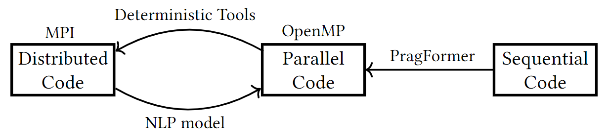
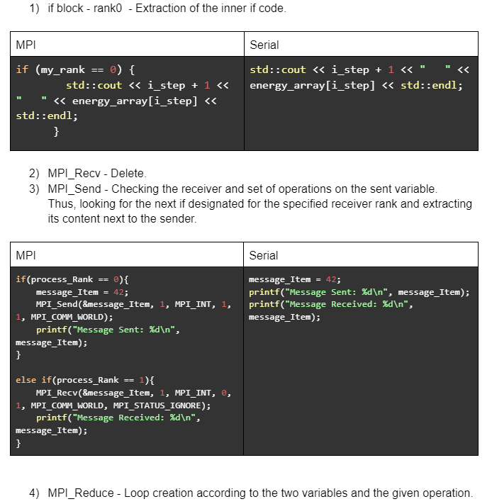
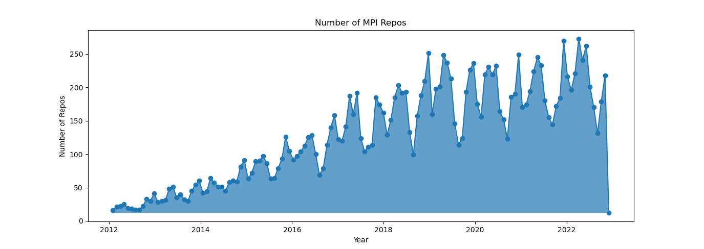
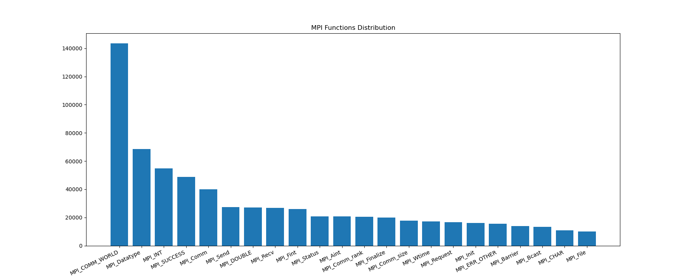

# Automatic Distributed Parallelism with MPI
We suggest easing the process of inserting MPI functions with NLP techniques.
 * To understand the variables' dependencies and the source code's flow, grasping large sequences is required.
 *  The attention mechanism inside transformers outputs contextualized vectors of the input data, and hence, a transformer is the most suitable model for the given task.
 * We ease the process of distributed parallelization coding by suggesting places and segments of the code that need synchronization (MPI functions), i.e., send/receive messages between different processes.
 * The proposed model can be incorporated with an IDE and become an "on-the-fly" parallelization advisor
 * Moreover, it can improve debugging by pointing out possible wrong or missing send/receive functions, mentioning unnecessary communications, and even suggesting non-blocking operations
          
## End-to-End Automatic Parallelization  ##

# Future Plans
In order to preprocess the data for a language model, pairs of MPI and serial/OpenMP code is required. This can be achived by both deterministic tools like CATO or OMP2MPI and also from the following proposed heuristics.

## MPI to Serial Heuristics
Example to a few of the proposed heuristics:

# Dataset
Load repositories including MPI from github between range of dates and extraction of the following statistics:

