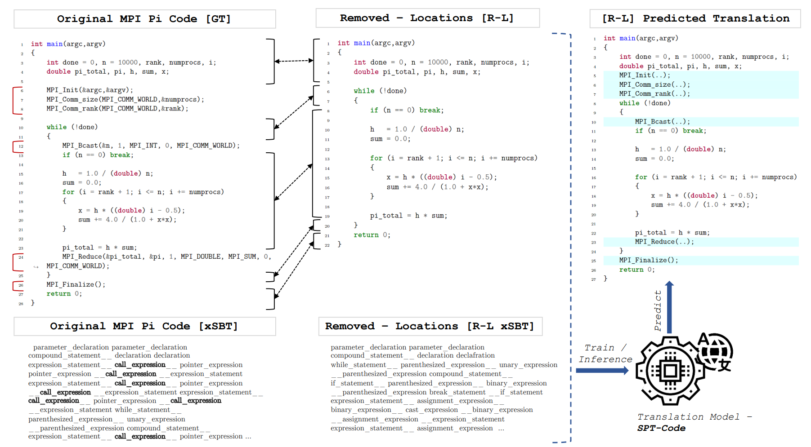
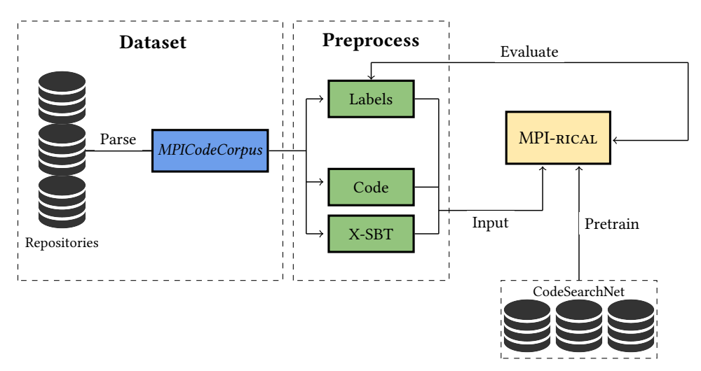

# MPI-rical: Data-Driven MPI Distributed Parallelism Assistance with Transformers
Automatic source-to-source parallelization of serial code for shared and distributed memory systems is a challenging task in high-
performance computing. While many attempts were made to trans-late serial code into parallel code for a shared memory environment - usually using OpenMP - none has managed to do so for a distributed memory environment. The evolving field of AI-based pro-gramming assistance tools, on the other hand, shows a promising direction that could offer an opportunity for developing a translator for serial code in distributed memory environment. In this paper, we propose a novel approach, called MPI-rical, for automated MPI code generation using a transformer-based model trained on approximately 25,000 serial code snippets (in C language) and their corresponding parallelized MPI code out of more than 50,000 code snippets in our corpus (MPICodeCorpus). In order to evaluate the performance of the model systematically, we first break down the serial code to MPI-based parallel code translation problem into two sub-problems and develop two research objectives: code completion defined as given a location in the source code, predict the MPI function for that location, and code translation defined as predicting an MPI function as well as its location in the source code. We evaluate MPI-rical on MPICodeCorpus dataset and on real-world scientific code benchmarks and compare its performance between the code completion and translation tasks. Our experimental results show
that while MPI-rical performs better on the code completion task than the code translation task - with an F1-score of 0.95 against
0.87 - the latter is better suited for real-world programming assistance, in which the tool suggests the need for an MPI function regardless of prior knowledge. Overall, our approach represents a significant step forward in automating the parallelization of serial
code for distributed memory systems, which can save valuable time and resources for software developers and researchers.
          
## Desired Objective  ##

The desired objective, exemplified by a Pi calculation code: Advice a programmer who is writing serial code on which MPI functions to call and where to place those to transform the code to a distributed one. The MPI functions suggested by MPI-rical are highlighted in red on the right. Note that MPI-rical currently does not suggest arguments to MPI functions. We plan to explore this feature in future work.

## MPI-rical Training and Evaluation  ##

Overview of the model’s training and evaluation. Three dataset subsets are created from MPICodeCorpus. Each subset
consists of three files constituting one example; MPI C code (label), Serial C code, and its AST. Our model, MPI-rical, which
has three sub-models, one for each subset, trains and evaluates these examples. These models address the two tasks of code
completion and code translation. MPI-rical’s models were pre-trained from the CodeSearchNet dataset.


# Instructions
## Requirments
First, clone the MPI-rical code provided here, the dataset subsets and SPT-Code.
```
clone https://github.com/Scientific-Computing-Lab-NRCN/MPI-rical.git
```
Then, two conda environments have to be created; SPTcode and code2mpi.
```
conda create --name <env_name> --file SPTcode
```
Then, activate your environment:
```
conda activate <env_name>
```
Download the right packages according to the official SPT-Code github: https://github.com/NougatCA/SPT-Code


# Citation
For more information about the measures and their means of the implementations, please refer to the paper.
If you found these codes useful for your research, please consider citing: 


## Running
### Evaluate
To evaluate the models activate the SPTcode environment and enter the source folder: 
```
conda activate SPTcode
cd Desktop/MPI-rical/SPT-Code/Source
```
Then, run the following:
* For evaluating code completion [P+L]:
```
python main.py --only-test --task completion --no-nl --batch-size 32 --max-code-len 320 --completion-max-len 320 --trained-vocab '/home/nadavsc/LIGHTBITS/SPT-Code/dataset/pre_trained/vocabs' --trained-model '/home/nadavsc/LIGHTBITS/SPT-Code/outputs/5_epochs_320_close_placeholder_completion/models'
```
* For evaluating Translation [P-L]:
```
python main.py --only-test --task translation --translation-source-language serial_c --translation-target-language mpi_c --no-nl --batch-size 32 --max-code-len 320 --trained-vocab '/home/nadavsc/LIGHTBITS/SPT-Code/dataset/pre_trained/vocabs' --trained-model '/home/nadavsc/LIGHTBITS/SPT-Code/outputs/5_epochs_320_close_placeholder_translation/models'
```
* For evaluating Translation [P-L+A]:
```
python main.py --only-test --task translation --translation-source-language serial_c --translation-target-language mpi_c --no-nl --batch-size 32 --max-code-len 320 --trained-vocab '/home/nadavsc/LIGHTBITS/SPT-Code/dataset/pre_trained/vocabs' --trained-model '/home/nadavsc/LIGHTBITS/SPT-Code/outputs/5_epochs_320_close_heuristics_translation/models'
```
Make sure to insert the right paths of both the model itself and the pre trained vocabs.

